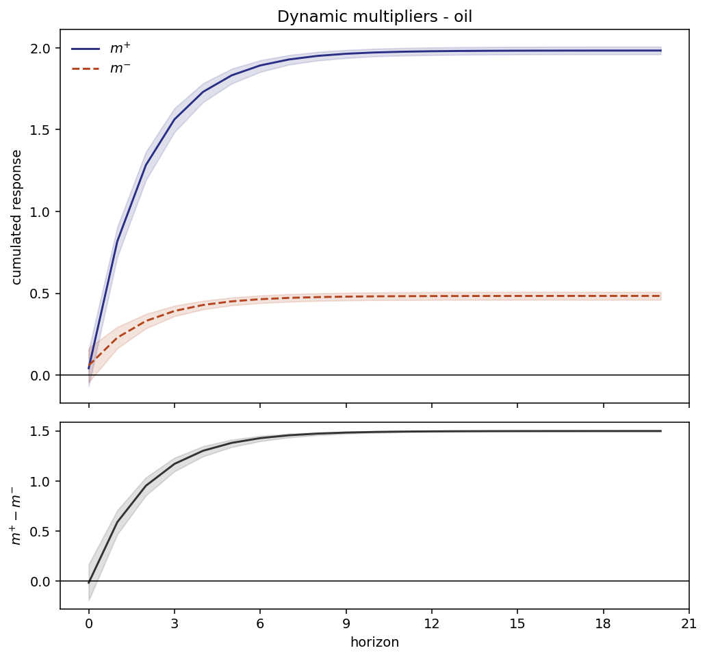

# NARDL — asymmetric responses

`pyardl.nardl`

An ARDL assumes `y` responds to a rise in `x` exactly as it responds to
a fall. Often it does not: prices climb faster than they come down,
consumption reacts to losses more than to gains. Shin, Yu and
Greenwood-Nimmo (2014) let the data say so, by splitting each regressor
into the part built by its rises and the part built by its falls:

```
x⁺ₜ = Σ max(Δxₛ, 0)        x⁻ₜ = Σ min(Δxₛ, 0)
```

and estimating the error-correction model on both pieces. The long run
then has two coefficients, `θ⁺ = −γ⁺/λ` and `θ⁻ = −γ⁻/λ`, and the
question "is the response asymmetric?" becomes a restriction to be
tested rather than an assumption.

**Nothing new is estimated.** After the decomposition the model is a
linear ARDL, so the whole library applies to it unchanged — same least
squares, same Wald machinery, same bounds test. That is the elegance of
the framework, and the reason this module is thin.

## Fitting

```python
from pyardl.nardl import NARDL

res = NARDL(y, x, asym=["oil"], order=(1, 1), case=3).fit()
print(res.summary())
```

```text
NARDL (Shin, Yu & Greenwood-Nimmo 2014) - case 3, asymmetric: oil, threshold=0.0
  observations: 299   lambda = -0.3996

  long-run coefficients
    variable    theta+       se    theta-       se  difference       se
         oil    1.9833   0.0118    0.4838   0.0122      1.4995   0.0021

  symmetry tests
    variable                test      stat    pvalue  verdict (5%)
         oil       longrun_gamma  565.8263    0.0000  asymmetric
         oil       longrun_theta490815.2491    0.0000  asymmetric
         oil   shortrun_additive    0.0349    0.8520  symmetric
         oil     shortrun_strong    0.0349    0.8520  symmetric
```

`asym` names the regressors to decompose; the others stay symmetric.
Omit it and every regressor is decomposed.

## The identity everything rests on

The decomposition is a regrouping, not a transformation that adds
information:

```
x = x₀ + x⁺ + x⁻
```

This holds exactly — to 1e-12 on any series — and it is tested before
anything else in the module, because an error here would not raise: it
would produce plausible, wrong results everywhere downstream.

!!! warning "A non-zero threshold breaks it"
    With a threshold `c ≠ 0` the identity becomes
    `x = x₀ + x⁺ + x⁻ + c·t`. The partial sums no longer add back to the
    series but to the series *minus a linear drift*. That drift does not
    vanish — it moves into the deterministic part of the model, and
    `θ⁺` is then read net of a trend nobody declared. `partial_sums`
    computes any threshold you ask for and warns when it is not zero.

## Choosing the lag orders

```python
model = NARDL(y, x, order="auto", max_p=3, max_q=3, ic="aic")
model.selection.head()
```

```text
selected: p=1, q={'oil_pos': 2, 'oil_neg': 2}

 p  q[oil_pos]  q[oil_neg]        aic        bic       hqic  nobs
 1           2           2 421.919631 455.163221 435.228218   297
 1           1           1 422.390345 448.246470 432.741468   297
 2           2           2 423.918996 460.856317 438.706315   297
 2           1           1 424.046296 453.596153 435.876151   297
 1           3           3 425.068056 465.699110 441.334107   297
```

Every candidate is estimated on the **same** sample — the one the
largest order can afford. Comparing information criteria computed on
different numbers of observations is meaningless, and it is the standard
way lag selection goes wrong.

`asym_lags` decides whether the two sides of a decomposed variable must
share an order:

| mode | grid | when |
|---|---|---|
| `"paired"` *(default)* | `q⁺ = q⁻` | halves the search, and keeps `shortrun_strong` meaningful — that test needs matching terms on both sides |
| `"free"` | each side independent | the more general search, and what much applied work does |

A candidate the sample cannot support is **skipped**, not scored with an
infinite criterion: leaving it in the ranking would present it as having
lost on merit rather than never having run.

## The four symmetry tests

```python
res.asymmetry_tests()
```

| test | null | reading |
|---|---|---|
| `longrun_gamma` | `γ⁺ = γ⁻` | the standard practice, a linear contrast |
| `longrun_theta` | `θ⁺ = θ⁻` | the same null through the ratio, by the delta method |
| `shortrun_additive` | `Σωᵢ⁺ = Σωᵢ⁻` | asymmetry in the cumulated short-run response |
| `shortrun_strong` | `ωᵢ⁺ = ωᵢ⁻ ∀i` | lag by lag, not on average |

The first two test **the same hypothesis** — `θ⁺ = θ⁻` is equivalent to
`γ⁺ = γ⁻` whenever `λ ≠ 0` — yet on real data they can differ by orders
of magnitude: 566 against 490 815 on the example above. That is Wald's
non-invariance to reparameterisation, not a bug, and it raises the
obvious question of which one to believe.

**Measured, on 1000 replications under true symmetry, T = 150:**

| test | rejection rate at a nominal 5% |
|---|---|
| `longrun_gamma` | 5.2% |
| `longrun_theta` | 5.7% |
| `shortrun_additive` | 5.8% |
| `shortrun_strong` | 5.8% |

All four hold their size. The huge gap between the two long-run
statistics is therefore about **power**, not validity: they agree on
whether to reject far more often than their magnitudes suggest. Both are
reported, and `longrun_gamma` — the best calibrated, and what the
literature quotes — is the one to lead with.

When nothing rejects, `res.suggests_symmetric_model()` returns `True`
and the summary says it in words: the extra parameters bought nothing,
and a symmetric ARDL describes the same data with fewer of them.

## Dynamic multipliers — the signature output

The multiplier at horizon `h` is the cumulated effect on `y` of a
one-unit permanent rise (resp. fall) in `x`. It is the path the long-run
coefficient takes to get where it goes, which is why this literature
plots it rather than tabulating it.

```python
res.plot_multipliers(h=20, r=2000, seed=42)
```



The lower panel is the one that answers the question. Two curves that
look far apart may still have overlapping bands; asymmetry shows when
the band on the **difference** excludes zero — which here it does from
horizon 1 onwards, but not at horizon 0, where the impact effect is
symmetric.

```text
            m_pos     m_neg  difference  difference_lower  difference_upper
horizon                                                                    
0        0.041630  0.059008   -0.017378         -0.192519          0.166253
1        0.817463  0.228733    0.588731          0.465698          0.707009
2        1.283295  0.330640    0.952655          0.856169          1.036023
5        1.831767  0.450627    1.381140          1.339479          1.412856
10       1.971465  0.481188    1.490277          1.481858          1.496271
20       1.983217  0.483759    1.499458          1.495272          1.503756
```

Bands come from **parameter simulation**: `r` draws from
`N(θ̂, V̂)`, the whole trajectory recomputed for each, pointwise
quantiles. Two consequences worth stating:

- They are **pointwise, not simultaneous**. A trajectory may leave them
  at some horizon without contradicting them; reading them as a band the
  whole path stays inside would overstate what they say.
- They are reproducible. The seed is recorded on the frame's
  `attrs['seed']` when you do not supply one, so a figure can be
  regenerated after the fact.

## The bounds test, and a convention that does not work

Each decomposed variable contributes **two** level terms. The literature
offers two readings of `k` for the critical values — count the pieces,
or count the original variable — and the specification asks for both to
be documented. Measurement settled it differently: **neither holds its
size.**

| reading | rejection rate at a nominal 5% |
|---|---|
| `decomposed`, `k = 2` per variable | 7.3% |
| `original`, `k = 1` per variable | 2.6% |
| *control:* a linear ARDL with 2 genuine regressors | 4.8% |

The control matters. A plain ARDL with two real regressors, same sample
size, same null, is correctly sized — so the over-rejection is **not**
the familiar small-sample behaviour of asymptotic critical values. It
comes from the decomposition itself, and two measurements say why:

- `x⁺` and `x⁻` are correlated at **−0.993** in levels, and their
  increments are never both non-zero: each moves on about half the
  dates. They are not two independent I(1) regressors, which is what the
  PSS tables assume.
- Decomposing a **stationary** series produces two *trending* series
  (measured slope +0.56 over 400 points). The I(0) bound is supposed to
  cover stationary regressors; no such world is reachable through the
  decomposition, so there is no meaningful lower bound here — a single
  critical value is the honest object.

`pyardl` therefore ships critical values simulated for this null
specifically, under the same protocol as the rest of the library, and
`res.bounds_test()` uses them. The `original` convention is refused with
its measurement rather than offered as a choice.

## API

| call | returns |
|---|---|
| `NARDL(y, x, asym, order, case, threshold)` | the model |
| `.fit()` | `NARDLResults` |
| `res.longrun_asym` | `θ⁺`, `θ⁻`, their difference and standard errors |
| `res.asymmetry_tests()` | the four Wald tests |
| `res.suggests_symmetric_model()` | `True` when nothing rejects |
| `res.bounds_test()` | cointegration test on the NARDL UECM |
| `res.dynamic_multipliers(h, r, seed, alpha)` | the trajectories and bands |
| `res.plot_multipliers(...)` | the figure above |
| `res.uecm`, `res.params`, `res.lam` | the fitted model |
| `partial_sums(x, threshold)` | the decomposition on its own |
| `decomposition_error(x, pos, neg)` | the identity, as a number to assert |

## References

- Shin, Y., Yu, B. & Greenwood-Nimmo, M. (2014). Modelling asymmetric
  cointegration and dynamic multipliers in a nonlinear ARDL framework.
  In *Festschrift in Honor of Peter Schmidt* (pp. 281-314). Springer.
