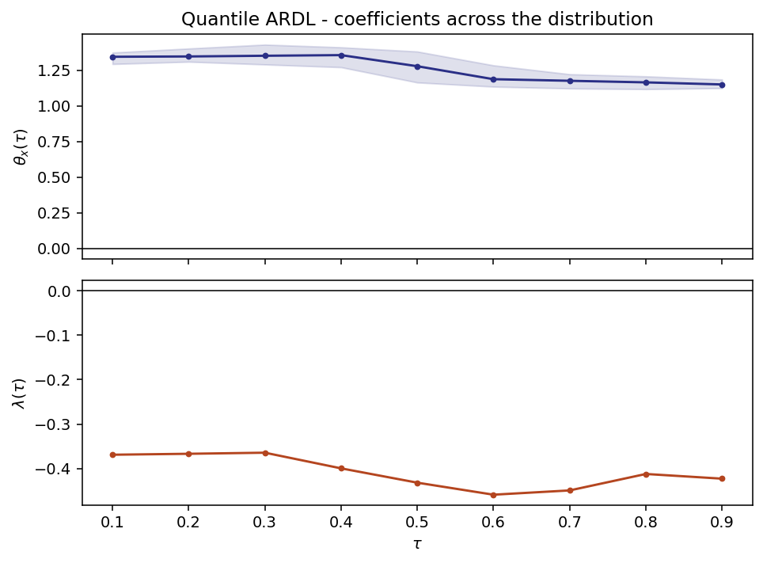

# QARDL — a relation that can differ across the distribution

`pyardl.qardl`

An ARDL describes the conditional **mean**. That is one number, and it
is the wrong number whenever the relationship is not the same everywhere
in the distribution — when a long-run link holds after bad shocks and
not after good ones, or when adjustment is fast in the lower tail and
slow in the upper.

Cho, Kim and Shin (2015) estimate the same error-correction model at a
grid of quantiles, so every parameter becomes a function of `τ`:

```
Q_Δy(τ) = d(τ) + λ(τ)·y_{t-1} + Σ γ_j(τ)·x_{j,t-1} + short-run terms
```

with long-run coefficients `θ_j(τ) = −γ_j(τ)/λ(τ)`. The question "does
the long run depend on the state of the world?" becomes a hypothesis to
test rather than an assumption to make in either direction.

**The design is the library's.** The columns come from the same builder
as the classical bounds test, so a QARDL at `τ = 0.5` and an ARDL are
one specification read under two losses — not two models that resemble
each other.

## Fitting

```python
from pyardl.qardl import QARDL

res = QARDL(y, x, order=(1, 1), taus=(0.1, 0.25, 0.5, 0.75, 0.9)).fit(
    inference="mbb", n_boot=199, seed=42
)
print(res.summary())
```

```text
QARDL (Cho, Kim & Shin 2015) - case 3, 5 quantiles, 299 observations
  inference: mbb, B=199, block=7, seed=42

     tau    lambda       theta_x
     0.1   -0.3690        1.3433
    0.25   -0.3807        1.3557
     0.5   -0.4319        1.2771
    0.75   -0.4305        1.1745
     0.9   -0.4229        1.1493

  joint tests across quantiles
   constancy           x  chi2(4) = 35.3844   p = 0.0000   varies with tau
    symmetry           x  chi2(2) = 32.5288   p = 0.0000   asymmetric
```

## What the estimator had to be told

Quantile regression has a property least squares does not: its optimum
is **exact**. It is a linear program, so there is a number no estimate
can beat, and any candidate can be scored on it — the check loss.

Scored that way, the obvious tool fails at its default settings.
`statsmodels`' iteratively reweighted least squares stops on a tolerance
of `1e-6`, and on ordinary data that is not enough:

| setting | excess loss vs the exact optimum | coefficient error |
|---|---|---|
| default (`p_tol=1e-6`) | up to **3.4e-03** | up to **2.6e-02** |
| `p_tol=1e-10` *(used here)* | ~1e-6 | ~1e-6 |

Nothing warns. The fit returns, the numbers look reasonable, and they
are 5% wrong. It is not the iteration count — raising `max_iter` alone
changes nothing.

So `pyardl` runs the solver at a tolerance that converges, and holds
itself to it: every estimate is checked against the linear-programming
optimum in the test suite. The linear program itself is shipped as
`quantile_regression_lp`, as an **oracle**, not an estimator — it is
about six times slower.

When the solver does stop on its iteration cap, the warning is
**earned** rather than assumed: the exact optimum is computed, the two
compared, and the alert raised only if the gap is real — in which case
the exact solution is returned instead. Measured on nearly collinear
designs, the cap fires on about one fit in a hundred and the estimate is
at the optimum anyway. A library that cries wolf teaches its users to
ignore it.

## Two inference routes, for two different questions

| route | gives | use |
|---|---|---|
| `"mbb"` *(default)* | the **joint** law across quantiles | required by the constancy and symmetry tests |
| `"kernel"` | a per-quantile covariance | fast, when a single quantile is being read |

The moving-block bootstrap resamples blocks of **rows** — target and
design together — so the dependence between neighbouring dates survives
and the link between a row's target and its regressors is never broken.
Block length defaults to `⌈T^(1/3)⌉`.

A per-quantile covariance cannot express how `θ(0.1)` and `θ(0.9)` move
together, so the joint tests refuse to run on it rather than quietly
assuming independence.

`n_boot` defaults to **299**: a p-value resolution of 1/300, ample at
conventional levels. Raise it when reporting a p-value near a threshold;
the cost is linear.

## The signature test: is the long run constant?

```python
res.wald_constancy()
```

`H₀: θ(τ₁) = … = θ(τ_m)`. Rejecting it says the long-run relation is not
a single number, and that a mean regression would have averaged the
finding away. Accepting it says the extra machinery bought nothing —
which is a useful result too.

`res.symmetry_test()` asks the narrower question `θ(τ) = θ(1−τ)`: whether
the two tails are treated alike. It needs a grid with mirror pairs, and
says so rather than pairing quantiles that are not mirror images.

### What the statistic is compared against

The Wald form `W = d'V⁻¹d` is the easy part. The reference distribution
is where this test can quietly fail, and the choice here was **measured**
rather than assumed.

The first attempt compared `W` to a chi-squared. Under a homogeneous
null it rejected **0.5%** of the time at a nominal 5% — a test that
almost never fires is not conservative, it is broken in a direction
nobody notices, because nothing looks wrong when a test stays silent.

The diagnosis was not the reference distribution but the bootstrap
behind `V`. Resampling **rows** of the design shuffles blocks of an
*integrated* regressor and destroys the stochastic trend that makes it
what it is. Measured, the resulting spread was **1.36×** the true
sampling spread, which deflates any statistic built on it by a factor of
1.85. Recalibrating against that same inflated distribution recovered
only 1.0%: the scale was not the whole story.

So the tests draw from the **null** instead, on the same principle the
rest of the library follows: the design is held fixed — it is not
random, and this literature does not treat it as such — and only the
innovations are resampled, in blocks, from the median fit. Under the
null of no quantile variation that *is* the data-generating process.

**Measured rejection rate under a homogeneous null** (200 replications,
`T = 150`, `B = 49`, three quantiles — every replication scored under all
three calibrations, on the same sample and the same draws):

| `calibration` | reference | rejection at a nominal 5% |
|---|---|---|
| `"null"` *(default)* | simulated under the null, fixed design | **3.0%** |
| `"mbb"` | the row-resampled draws, self-calibrated | 1.0% |
| `"chi2"` | the asymptotic reference | 0.5% |

Read that carefully. It establishes that the default is far better than
the alternatives — the gap between 0.5% and 3.0% is more than one and a
half standard errors, and reproducible. It does **not** establish that
the size is correct: at 200 replications the standard error is 1.5
points, so 3.0% sits 1.3 standard errors from 5%. The test is probably
still conservative, and that is written here rather than left to read as
a clean bill of health.

The bands on `θ(τ)` still come from the row-resampled draws, and are
therefore **wider than they need to be** by roughly the same factor.
That is stated rather than hidden: a band that is too wide understates
what the data say, which is the safer of the two errors but is still an
error.

## Cointegration at a quantile

```python
res.cointegration_test(tau=0.5, n_boot=299, seed=42)
```

```text
tau                   0.5
lambda          -0.431931
t_stat         -11.022612
cv_10           -2.711421
cv_5            -2.940898
cv_1            -3.897946
pvalue              0.005
n_boot                199
decision    cointegration
```

The t ratio on `λ(τ)`, and — exactly as in the classical framework — with
a **non-standard** distribution, because the regressors are integrated.
No tabulated t applies, so the critical values are generated here: data
are regenerated under a null with the level terms deleted, and the
quantile regression re-estimated on each sample.

Left-tailed, as it must be: rejection needs a *negative* estimate, an
actual pull back towards equilibrium.

## The picture

```python
res.plot_coefficients()
```



A flat line is the finding that a mean regression would have sufficed. A
sloped one is the finding that it would not.

## QNARDL — composing with asymmetry

```python
res = QARDL(y, x, order=(1, 1), asym=["oil"]).fit()
```

`asym` splits a regressor into its partial sums before estimating, so
the long run becomes `θ⁺(τ)` and `θ⁻(τ)`: a response that may differ
both between rises and falls *and* across the distribution. It reuses
the decomposition of [`pyardl.nardl`](nardl.md), identity check
included.

## Limits, stated

- The joint tests estimate an `(m−1)×(m−1)` covariance from `n_boot`
  draws. That ratio, not the grid size alone, is what makes the test
  usable; the measured behaviour is in the validation register.
- `λ(τ)` can be indistinguishable from zero at some quantiles. The long
  run is a ratio with it in the denominator, so it is reported as `NaN`
  there, with a warning — not as a very large number.
- Cost is linear in `taus × n_boot`. A 19-point grid with `n_boot=299`
  is a few minutes, not a few seconds.

## References

- Cho, J. S., Kim, T. & Shin, Y. (2015). Quantile cointegration in the
  autoregressive distributed-lag modeling framework. *Journal of
  Econometrics*, 188(1), 281-300.
- Koenker, R. (2005). *Quantile Regression*. Cambridge University Press.
